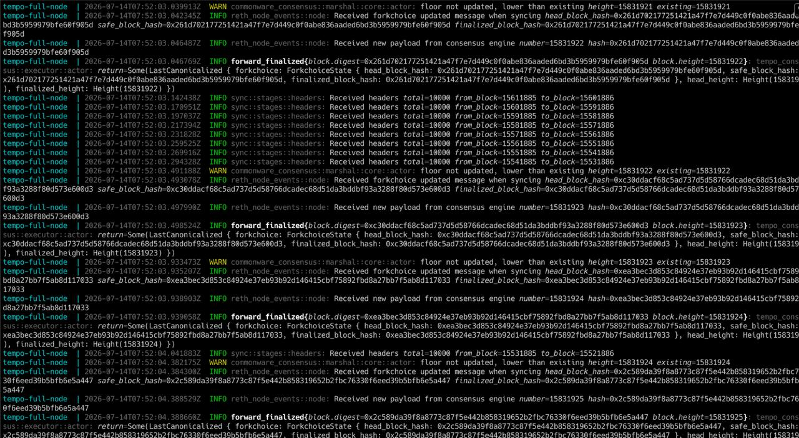

# node-pakxenet

Tempo full node for the Pakxe network, running via Docker Compose using the official [`ghcr.io/tempoxyz/tempo`](https://github.com/tempoxyz) image.

## Overview

The compose file starts a single `tempo-full-node` container that:

- Uses `config/genesis.json` as the chain spec
- Stores chain data in `./data/full-node` (created on first run)
- Connects to a trusted peer at `204.168.179.190:6001` and follows the consensus feed at `ws://204.168.179.190:18546`
- Exposes the JSON-RPC HTTP API on port `8545` (all APIs enabled)
- Runs with `network_mode: host`, so P2P ports `9001` (discovery), `9005` (discovery v5), and `9003` (authrpc) bind directly on the host

## Prerequisites

- Docker with the Compose plugin
- Open outbound access to the trusted peer, and inbound access on the P2P ports if you want other peers to reach the node

## Usage

Start the node:

```bash
docker compose up -d
```

Follow the logs:

```bash
docker logs -f tempo-full-node
```

Check sync status via JSON-RPC:

```bash
curl -s -X POST http://localhost:8545 \
  -H 'Content-Type: application/json' \
  -d '{"jsonrpc":"2.0","method":"eth_blockNumber","params":[],"id":1}'
```

Stop the node:

```bash
docker compose down
```

## Syncing

The node syncs headers in batches and finalizes blocks as forkchoice updates arrive from the consensus engine:



## Layout

```
.
├── docker-compose.yml   # Full node service definition
├── config/
│   └── genesis.json     # Chain spec
├── data/                # Chain data (created at runtime, not committed)
└── docs/
    └── node-sync.jpg    # Sync log screenshot
```

Container logs are capped at 3 × 10 MB via the json-file logging driver.
